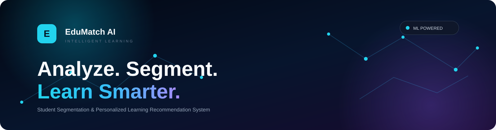
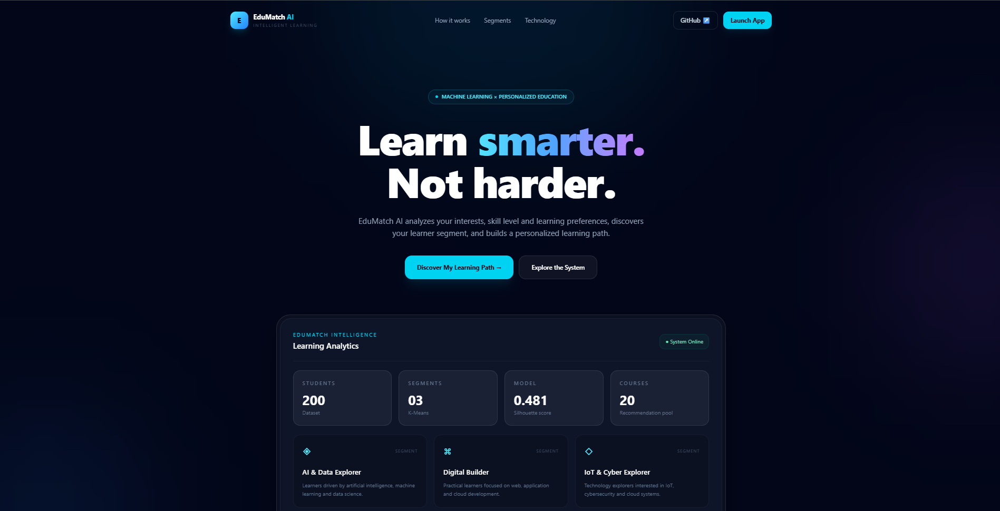
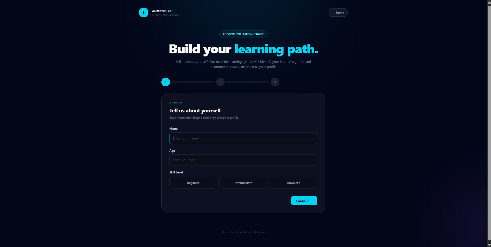
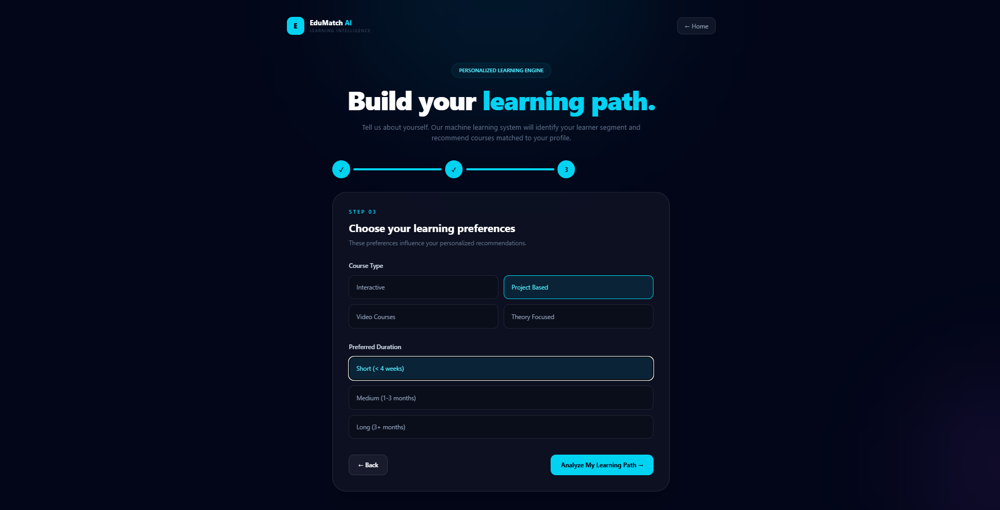
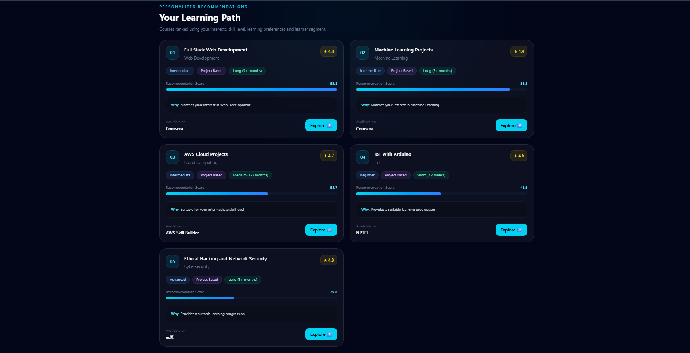

<p align="center">
  
</p>

# ⚡ EduMatch AI

### Student Segmentation & Personalized Learning Recommendation System

**Analyze. Segment. Learn Smarter.**

An ML-powered full-stack application that analyzes student profiles, identifies learner segments using K-Means clustering, and generates personalized course recommendations.

<br>


<br>

[🚀 Launch Application](http://localhost:5173) •
[🧠 ML Pipeline](#-machine-learning-pipeline) •
[🏗️ Architecture](#️-system-architecture)

</div>

---

# ✨ What is EduMatch AI?

EduMatch AI is a full-stack machine learning application designed to help students discover learning opportunities that match their individual profiles.

The system takes a student's:

- Age
- Skill level
- Interests
- Preferred course type
- Preferred duration

and processes this information through a machine learning pipeline to:

1. Engineer meaningful student features
2. Segment students using K-Means clustering
3. Identify the student's learning segment
4. Score available courses
5. Generate personalized course recommendations

---

# 🚀 Features

## 👤 Student Profiling

Students can enter:

- Age
- Skill level
- Areas of interest
- Preferred course type
- Preferred learning duration

## 🧠 AI-Based Student Segmentation

EduMatch AI uses **K-Means clustering** to identify learner segments.

| Segment | Description |
|---|---|
| 🤖 AI & Data Explorer | AI, Machine Learning and Data Science |
| 💻 Digital Builder | Web, App and Cloud technologies |
| 🔐 IoT & Cyber Explorer | IoT, Cybersecurity and Cloud technologies |

## 🎯 Personalized Course Recommendations

Courses are scored using:

- Interest matching
- Skill-level compatibility
- Course type
- Duration
- Course rating
- Learner segment

---

# 📸 Screenshots

## 🏠 Landing Page



---

## 👤 Student Profile



---

## 🎯 Learning Preferences



---

## 🚀 Personalized Recommendations



---

# 📊 ML Model Evaluation

Several K-Means configurations were evaluated.

| K | Inertia | Silhouette Score |
|---:|---:|---:|
| 2 | 1453.35 | 0.380 |
| 3 | 867.01 | **0.481** |
| 4 | 788.86 | 0.318 |
| 5 | 731.98 | 0.331 |
| 6 | 692.72 | 0.250 |
| 7 | 641.02 | 0.259 |
| 8 | 615.97 | 0.218 |

### Selected Model

**K = 3**

**Silhouette Score = 0.481**

---

# 🧠 Machine Learning Pipeline

```text
Student Profile
       │
       ▼
Feature Engineering
       │
       ▼
Preprocessing
       │
       ▼
Feature Scaling
       │
       ▼
K-Means Clustering
       │
       ▼
Learner Segment
       │
       ▼
Recommendation Engine
       │
       ▼
Personalized Courses